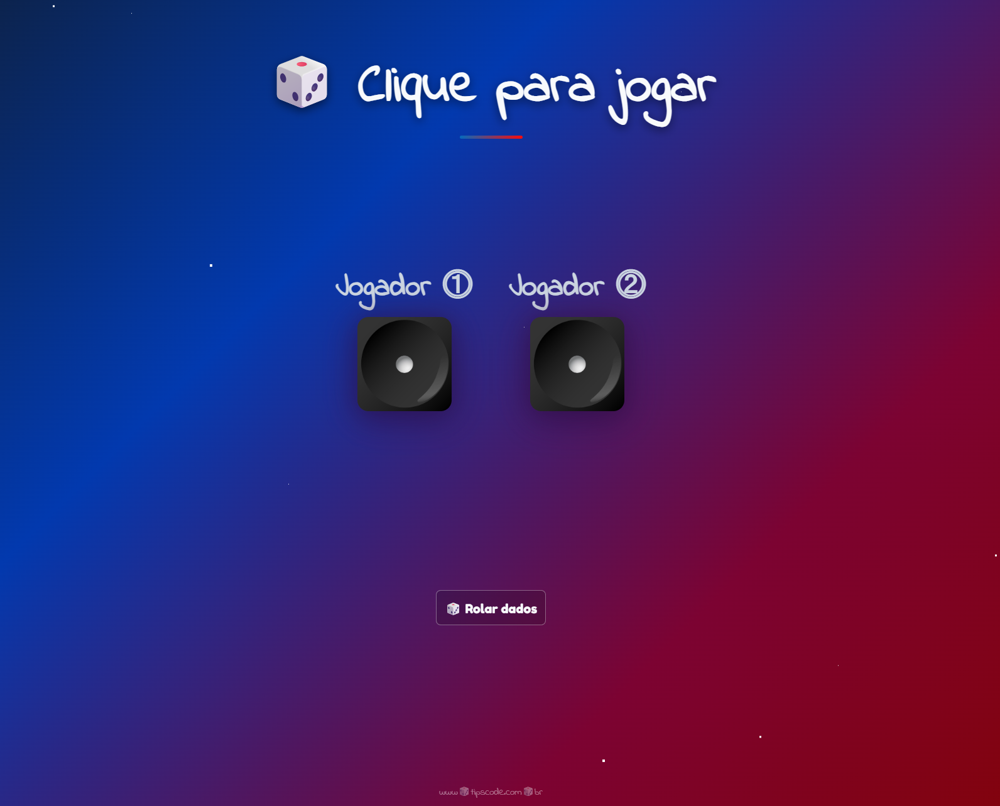

## 🎲 Jogo de Dados em JavaScript



🔗 **Demo:** https://maiconsouzazzss.github.io/Jogo-de-dados-Js/

Projeto simples desenvolvido para praticar **JavaScript**, **CSS** e **manipulação do DOM**, com foco em animações, responsividade e experiência do usuário.

---

## 🚀 Funcionalidades

- Sorteio aleatório dos dados
- Animação dos dados ao clicar em **🎲 Rolar dados**
- Indicação visual do jogador vencedor
- Layout responsivo (desktop e mobile)
- Fundo animado com efeito de estrelas

---

## 🛠️ Tecnologias utilizadas

- HTML5
- CSS3
- JavaScript (Vanilla)

---

## ▶️ Como executar o projeto

1. Clone o repositório:
   ```bash
   git clone https://github.com/Maiconsouzazzss/Jogo-de-dados-JJs.git
